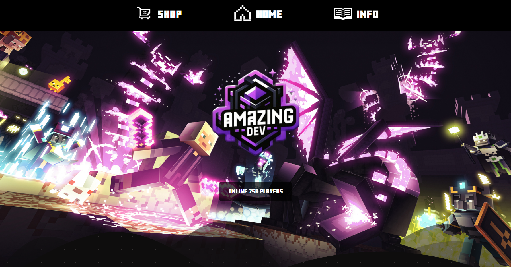
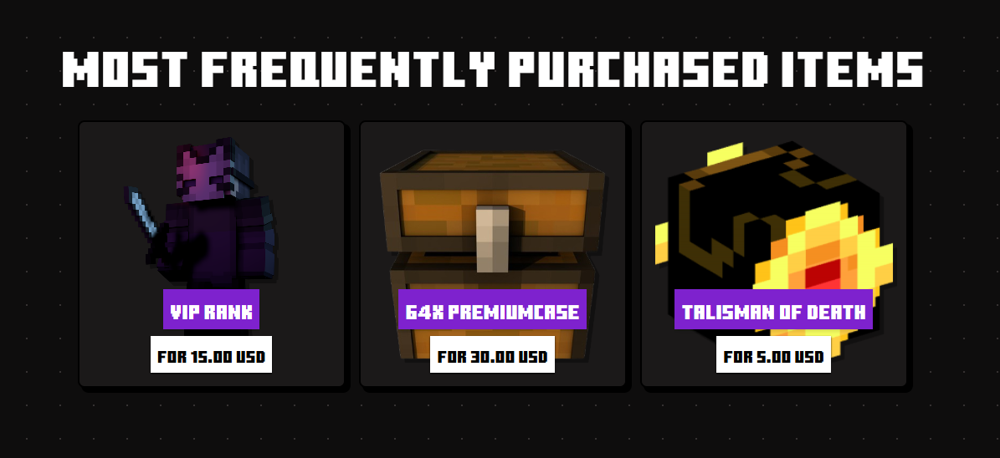

# 🛡️ AmazingDev Server Website

AmazingDev Server Website is a dynamic web page designed for the AmazingDev Minecraft server, featuring real-time player count updates, a shop section with the most popular items, and an embedded latest server video from YouTube.

## 🚀 Features

- Live Player Count – The number of online players updates in real-time.
- Most Popular Items – Displays the most frequently purchased items, linking directly to the server's shop.
- Latest Server Video – Showcases the most recent video from the server’s YouTube channel.
- Fully Responsive – Optimized for both desktop and mobile devices.
- Smooth Animations – Clean and modern UI with smooth transitions.

    
    

## ℹ FAQ

### How does the live player count work?

The website automatically fetches and updates the number of online players without needing a page refresh.

### Where can I buy items for the server?

The shop section highlights the most popular items and provides a direct link to the server’s official store.

### How is the latest video selected?

The featured video is manually updated to showcase the best or newest content from the server’s YouTube channel.

### Is the site optimized for mobile users?

Yes! The design ensures a seamless experience across all devices.
